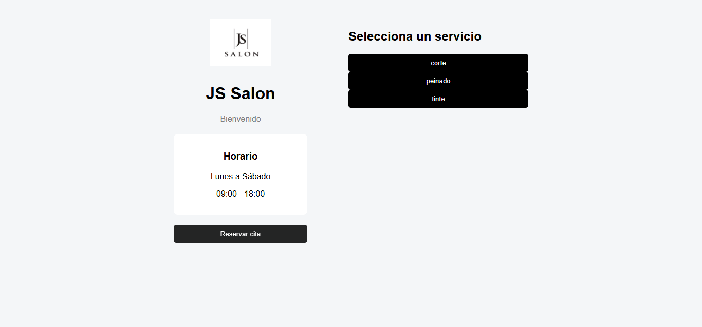
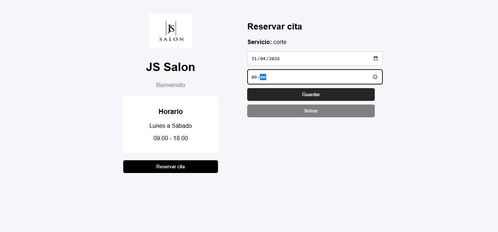
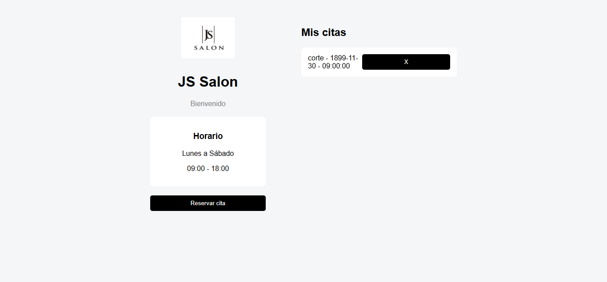

### 💇‍♀️ JS Salon - Appointment System

Web application for managing appointments in a beauty salon.

📌 Note: This README is written in English for accessibility. The application interface is in Spanish (original language).

---

### 🚀 Technologies
	•	Frontend: HTML, CSS, JavaScript
	•	Backend: Node.js (Express)
	•	Database: MySQL

---    

### 🎥 Demo

👉 https://youtu.be/UlUgEFQVC80

---

### 🎨 Prototype (Figma)

Initial UI design used as a base for the application development.

👉 View interactive prototype (https://www.figma.com/proto/4BXtBHur72CoU4b0GIhFjK/Js-Salon-App--Copy-?node-id=0-1&t=AV7HvfyZ3i44Htwc-1)

---

### 🖼️ Application Screenshots

### 🏠 Home Screen
Initial view where users can access the reservation flow.

---

### 📅 Date and Time Selection
Users can select an available date and time within the allowed.
schedule (09:00- 18:00).

---

### 💾 Booking Confirmation 
Interface where users confirm or cancel their appointment.

---

## ⚙️ Features

- View available services
- Create an appointment
- Delete an appointment
- Schedule validation (09:00 - 18:00)

---

## 📂 Project Structure

---

## 🛠️ Installation

1. Clone the repository
2. Install dependencies
3. Set up the database

- Create a MySQL database
- Run database/schema.sql

4. Run the backend
5. Open the frontend

Open frontend/index.html in your browser

---

## 📌 Notes

This project demonstrates the implementation of a functional reservation system, including service selection, date and time scheduling, and real-time data handling.

It showcases full integration between frontend, backend, and database.
:::